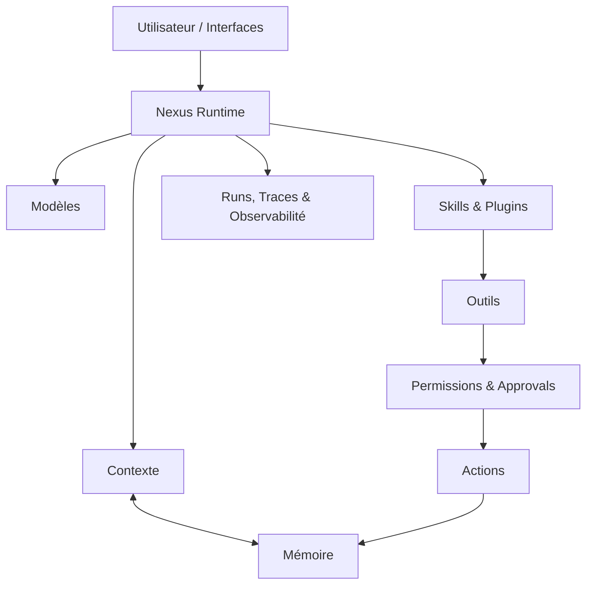

# Nexus

### Une intelligence personnelle, local-first, modulaire et construite pour durer.

Nexus est un projet d'assistant personnel conçu autour d'une idée simple :

> Une IA utile ne devrait pas seulement répondre à des messages.  
> Elle devrait pouvoir comprendre un contexte, conserver une continuité, utiliser des capacités adaptées et agir de manière contrôlée.

Le projet cherche donc moins à construire **un chatbot de plus** qu'un runtime capable de relier modèles, mémoire, outils, projets et interfaces dans un système cohérent.

Nexus est encore en développement.  
L'objectif actuel n'est pas de prétendre avoir résolu l'assistant personnel idéal, mais d'en construire progressivement les fondations.

---

## Pourquoi Nexus ?

Les assistants modernes sont extrêmement capables, mais leur intelligence reste souvent enfermée dans une conversation.

Ils connaissent peu l'environnement dans lequel ils travaillent, perdent facilement le contexte à long terme et dépendent de systèmes externes pour leur mémoire, leurs outils ou leur continuité.

Nexus explore une autre approche :

**faire de l'IA une capacité durable de l'environnement personnel de l'utilisateur.**

Cela implique notamment de pouvoir :

- conserver une mémoire structurée ;
- comprendre le contexte d'un projet ou d'une session ;
- choisir et utiliser différents modèles ;
- accéder à des outils avec des permissions explicites ;
- apprendre de nouvelles capacités réutilisables ;
- garder une trace compréhensible de ce qui s'est passé ;
- rester observable et contrôlable par l'utilisateur.

---

## Local-first

Nexus est pensé comme un système **local-first**.

La mémoire, l'état du runtime, les permissions, les projets et les traces doivent rester sous le contrôle de l'utilisateur.

Cela ne signifie pas qu'un seul modèle ou qu'un seul fournisseur doit être utilisé.

Nexus cherche au contraire à rendre les modèles **interchangeables** : locaux ou distants, généralistes ou spécialisés, tant que leur utilisation apporte un bénéfice réel et respecte les règles définies par le runtime.

Le modèle est une composante de Nexus.

Il n'est pas Nexus.

---

## Architecture

Nexus est construit autour d'un runtime central qui coordonne les différentes capacités du système.

Une requête peut ainsi traverser plusieurs couches :

**intention → contexte → mémoire → modèle ou capacité → outil → autorisation → action → trace**

L'objectif est de garder ce chemin aussi explicite que possible.

Une réponse, une lecture de fichier, une commande système ou une action sensible ne représentent pas le même niveau de pouvoir et ne doivent donc pas être traitées de la même façon.

---

## Mémoire

La mémoire n'est pas simplement un historique de conversation.

Nexus cherche à distinguer plusieurs formes de continuité :

- le contexte immédiat d'une session ;
- la mémoire durable ;
- les informations propres à un projet ;
- l'expérience réutilisable d'une capacité ;
- les événements et traces produits par le runtime.

Cette séparation permet d'éviter qu'un gigantesque historique devienne progressivement la seule définition de ce que « sait » Nexus.

La mémoire doit pouvoir être inspectée, corrigée et comprise.

---

## Skills

Une **Skill** représente une capacité réutilisable.

Elle peut progressivement regrouper :

- des connaissances ;
- des outils ;
- une stratégie d'utilisation ;
- des évaluations ;
- de l'expérience ;
- éventuellement un modèle spécialisé.

Une Skill n'est donc pas simplement un prompt enregistré.

À terme, une demande comme :

> « Nexus, apprends Go. »

pourrait conduire Nexus à déterminer ce qu'il lui manque, préparer les capacités nécessaires, tester différentes approches et vérifier qu'elles améliorent réellement ses performances avant de les conserver.

L'objectif n'est pas d'accumuler des modèles ou des agents.

L'objectif est d'acquérir **les bonnes capacités lorsque leur utilité peut être démontrée**.

---

## Outils et contrôle

Donner des outils à un modèle est facile.

Construire un système dans lequel leur utilisation reste compréhensible et maîtrisée l'est beaucoup moins.

Nexus distingue donc le raisonnement du modèle de l'autorisation réelle d'agir.

> **Le modèle propose. Nexus autorise. L'utilisateur garde le contrôle.**

Les capacités sensibles doivent pouvoir être limitées par :

- leur scope ;
- des permissions ;
- des policies ;
- des validations humaines ;
- des traces ;
- des environnements isolés lorsque nécessaire.

Connaître le contexte d'un projet ne signifie jamais obtenir automatiquement les droits d'agir dessus.

**Context ≠ Authorization.**

---

## Observable par conception

Un système agentique devient rapidement difficile à comprendre s'il ne montre que son résultat final.

Nexus cherche donc à rendre visibles les éléments importants de son fonctionnement :

- les runs ;
- les outils utilisés ;
- les décisions d'orchestration ;
- les mémoires consultées ;
- les approvals ;
- les erreurs ;
- les évaluations.

L'objectif n'est pas d'exposer chaque pensée interne d'un modèle, mais de rendre le **comportement du système vérifiable**.

Si Nexus agit, il doit être possible de comprendre ce qu'il a fait.

---

## Une architecture composable

Une grande partie de la direction actuelle de Nexus repose sur un principe :

> **préférer quelques capacités générales et composables à une accumulation de comportements codés individuellement.**

Une nouvelle utilisation de Nexus ne devrait pas systématiquement nécessiter une nouvelle règle spécifique.

Mémoire, contexte, outils, Skills, modèles, permissions et observabilité doivent pouvoir être recombinés pour résoudre des problèmes différents.

Cette philosophie reste pragmatique : une abstraction n'a aucune valeur simplement parce qu'elle est élégante.

Si une solution plus simple est plus fiable, plus sûre ou plus compréhensible, elle doit être préférée.

---

## Ce que Nexus n'essaie pas d'être

Nexus n'est pas conçu comme :

- une surcouche de prompts autour d'un LLM ;
- un assistant entièrement autonome ayant accès à tout le système ;
- un gigantesque système multi-agent par défaut ;
- une collection de modèles spécialisés installés « au cas où » ;
- un produit prétendant disposer aujourd'hui de capacités encore expérimentales.

L'ambition du projet est importante.

La manière de l'atteindre doit rester progressive.

---

## État du projet

Nexus est actuellement en **développement actif**.

La priorité est la stabilisation d'une première fondation suffisamment fiable pour être utilisée comme un véritable produit personnel :

- runtime et orchestration ;
- mémoire ;
- Projects et contexte ;
- outils ;
- plugins ;
- traces ;
- permissions et approvals ;
- interfaces Web et CLI ;
- tests et observabilité.

Chaque nouvelle couche doit s'appuyer sur ce qui fonctionne réellement plutôt que sur une architecture future supposée.

> **Construire le socle avant d'empiler l'intelligence.**

Ce dépôt public reste pour le moment volontairement minimal et sert principalement à présenter la direction du projet.

---

## La suite

À court terme, Nexus doit surtout devenir un assistant personnel que l'on peut réellement utiliser au quotidien : durable, observable, extensible et capable de travailler avec différents modèles et différentes capacités sans perdre sa cohérence.

La suite dépendra de ce que cette première fondation permettra réellement de faire.

Et derrière cette trajectoire commence doucement à apparaître une autre idée.

### NexusOS

Pas un système d'exploitation réécrit de zéro.

Mais, peut-être, l'évolution naturelle de Nexus en une **couche intelligente locale au-dessus de Linux** : capable de comprendre son environnement, de composer ses capacités et d'agir sur le système — sans retirer à l'utilisateur le dernier mot.

**Linux en dessous. Nexus au-dessus.**

---

## License

MIT
